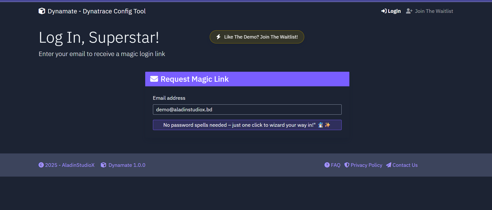
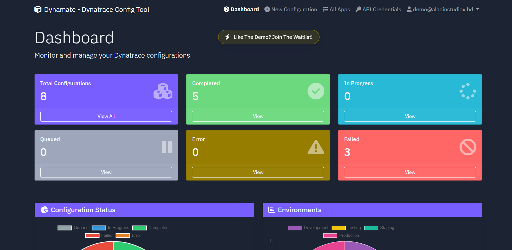
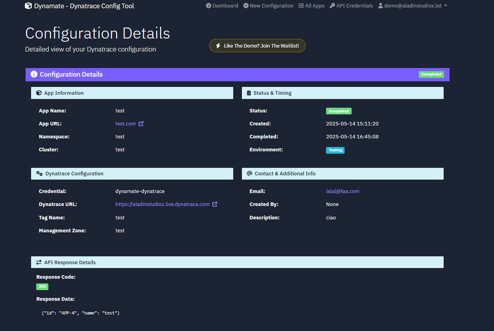

    

# Dynamate – Dynatrace Configuration Made Simple
<!--  -->
Deploy, configure, and monitor your app on Dynatrace in minutes.
Dynamate is a self-service web interface that lets you quickly build Dynatrace configuration pipelines using intuitive guided forms and built-in best practices — no complex YAML, Jenkins, or pipeline setup required.

---
## 🚀 What It Does

- ✅ Build Dynatrace configurations using easy, gamified forms  
- ✅ Apply configurations that follow Dynatrace best practices  
- ✅ Automate complete monitoring setup for your app—tagging, management zones, alerting profiles, notifications, and dashboards included  
- ✅ Enable fast and consistent Dynatrace setup for modern cloud-native applications  
- ✅ Track the status of every applied configuration and delete it with a single click when no longer needed  
- ✅ **Demo mode** available — experience the tool’s capabilities without connecting to your environment  

---

## 👤 Who It’s For

This tool is made for:

- **DevOps / SRE / Platform teams** working with the Dynatrace platform
- **Observability teams** looking to enable self-service monitoring for their organization   
- **Developers** who want fast, easy monitoring without the hassle of YAML or Jenkins or Using Dyntrace UI.

---

## 🧪 Try the Demo

You can test-drive the experience by logging in as a demo user:

👉 [**Click here to explore the demo**](https://aladinstudiox.pythonanywhere.com/)

_This demo does not connect to your Dynatrace account. It’s meant to preview the user interface and flow._

---
## 📩 Want Early Access?

Be part of the pre-release group and help shape the future of Dynamate.

👉 [**Join the waiting list**](https://aladinstudiox.pythonanywhere.com/register/)

---

## 🗣️ Give Feedback

We’d love to hear from you — what’s painful about configuring Dynatrace today?

📝 [Share your thoughts](https://tally.so/r/nGy672)

---
 <!-- commented for demo gif 
## 📸 Screenshots

---
-->
## ❓ Frequently Asked Questions

Looking for more details?

📚 [Read the FAQ](https://aladinstudiox.pythonanywhere.com/faq/)

---

## 🔐 Security & Credentials

Dynamate interacts with your Dynatrace environment using a personal API token.  
We **do not** share or expose your credentials. Learn more on the website.

---

## 🤝 Connect & Follow

Want to follow the project or get in touch?

🔗 [Connect on LinkedIn](https://linkedin.com/in/yourname)

---
## 👨‍💻Authors

- [@Aladdin-97](https://www.github.com/Aladdin-97)

> _This repository is for public documentation and visibility only. Source code is not published at this time._
